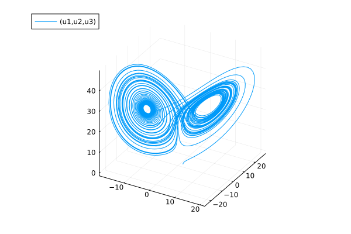
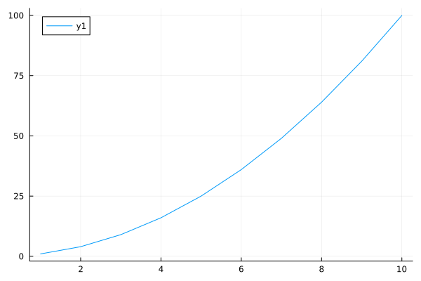

# Practical introduction to Julia-basics

We will cover:
- some more introduction
- docs
- variables
- datatypes
- arrays (longer exercise)
- flow control (small exercise)
- functions (larger exercise)
- multiple dispatch
- modules and packages

## Aside 1: Jupyter Notebooks

These slides are a [Jupyter notebook](https://jupyter.org/); a browser-based computational notebook.

Code cells are executed by putting the cursor into the cell and hitting `shift + enter`.  For more
info see the [documentation](https://jupyter-notebook.readthedocs.io/en/stable/).

## Aside 2: What is your previous programming experience?

1. Matlab/Octave
2. Python
3. R
4. other scripting languages (IDL, Mathematica, Perl...)
5. C, Fortran, ...
6. Pascal, Java, C++, ...
7. Lisp, Haskell, Assembler, Coq ...

(no prior programming experience?)

### What does Julia look like

Revisiting the Lorenz system of ODEs:

````julia
using OrdinaryDiffEq, Plots

function lorenz(x, p, t)
    σ = 10
    β = 8/3
    ρ = 28
    [σ*(x[2]-x[1]),
     x[1]*(ρ-x[3]) - x[2],
     x[1]*x[2] - β*x[3]]
end

# integrate dx/dt = lorenz(t,x) numerically from t=0 to t=50 and starting point x₀
tspan = (0.0, 50.0)
x₀ = [2.0, 0.0, 0.0]
sol = solve(ODEProblem(lorenz, x₀, tspan), Tsit5())
````

````
retcode: Success
Interpolation: specialized 4th order "free" interpolation
t: 620-element Vector{Float64}:
  0.0
  1.7848218463483522e-5
  0.00019633040309831873
  0.0019811522494466707
  0.006152643941135476
  0.012325670563201933
  0.020801249801853383
  0.0323600829092016
  0.047571186371870494
  0.06728252368366441
  0.09239922708381416
  0.1239649122017066
  0.15999636155417213
  0.1995126847603551
  0.24258937699565059
  0.2886423218427039
  0.3372827346681519
  0.379842748211382
  0.42805119777974066
  0.4682748479731282
  0.524639336008382
  0.5736400669498303
  0.6360014663934562
  0.6973755649647218
  0.7716187931491635
  0.8536156387622104
  0.9447501031377057
  1.0417790100911912
  1.148902301142154
  1.2531680313404165
  1.384849169939656
  1.4998451864904623
  1.6199334200386164
  1.7397959583645077
  1.856155879512933
  1.996451358268824
  2.118851205119273
  2.245650465175955
  2.366876837751308
  2.4865011682483256
  2.6311789120290205
  2.753750938668196
  2.8794968432495835
  3.0026587601811814
  3.121243191495206
  3.267285531108388
  3.3887353318328763
  3.5118149933366007
  3.637190975404219
  3.7543655737478985
  3.8980190763113454
  4.019202795247699
  4.13924817083695
  4.26595861652411
  4.381668586849759
  4.523181159157135
  4.643540637217161
  4.761290438093975
  4.886648838767666
  5.000919126776315
  5.141727868605536
  5.260100725353654
  5.37672768296617
  5.497465256110912
  5.609934917999718
  5.753474900849987
  5.868024021742257
  5.985629047207962
  6.097868181517305
  6.208874977098789
  6.355036899738327
  6.465768421325181
  6.587223634200628
  6.69137037811128
  6.801448785540362
  6.930833780696688
  7.045636990512673
  7.169065848117877
  7.271616186630515
  7.385649836933878
  7.497909709956229
  7.627908059084619
  7.740751509917001
  7.85099440013176
  7.955458269072624
  8.059463688813695
  8.18806680629615
  8.29749209043051
  8.418271767468992
  8.516484173324558
  8.627476347608551
  8.733841236477701
  8.871308007770363
  8.97669768310772
  9.090488372257372
  9.184962489396579
  9.286534034118203
  9.398810858868456
  9.512617556123455
  9.624037769438905
  9.727375011133462
  9.822907004821301
  9.919237878694803
 10.028875307653276
 10.13896427982768
 10.24839905221934
 10.351372138469396
 10.442779002265603
 10.536969413157015
 10.640769393975964
 10.755532695509036
 10.859486020374945
 10.967050508602906
 11.055397215183014
 11.151348309505387
 11.25084176896756
 11.383517801638334
 11.478924206234291
 11.593183054637759
 11.680658309920299
 11.781466213354452
 11.87596200813529
 11.99082197295026
 12.087173312925941
 12.197518912140424
 12.29027138506078
 12.375678406803324
 12.461450850705484
 12.55406827268632
 12.660472172510053
 12.75470647428354
 12.858883215579839
 12.947548289587854
 13.028862680980977
 13.110526189614157
 13.197580275832307
 13.302734582872468
 13.389313483764019
 13.496084738140286
 13.583094626809785
 13.663431232441734
 13.746625305255392
 13.833899329076726
 13.924137905326956
 14.007236562200996
 14.106129035728507
 14.19994023505204
 14.286463049368189
 14.359506318904769
 14.435515214571401
 14.515747999849433
 14.598808685819817
 14.67324319058403
 14.759384492938768
 14.8600115085707
 14.944435330457832
 15.017628589771205
 15.083258767120595
 15.149409945817785
 15.215957440898865
 15.282315240365312
 15.341358021500078
 15.398478155499296
 15.461369860421678
 15.530343145334141
 15.618234535204659
 15.70804788447231
 15.793158529396361
 15.867499609307632
 15.927209942921415
 15.983842748342576
 16.036374381110154
 16.101683239200252
 16.163693432236528
 16.225802432895687
 16.292262275567488
 16.36644012723927
 16.456089771923512
 16.535757339704627
 16.611035163057785
 16.685030960896338
 16.755359361046217
 16.829914928911716
 16.927060117663437
 16.99890168149199
 17.099564300951187
 17.189139850976996
 17.274262140748796
 17.346584734400164
 17.424617142249794
 17.50544232163225
 17.57395336094488
 17.64835687495465
 17.72150865898684
 17.81056266094827
 17.91131705831958
 17.990160031986395
 18.05834038489424
 18.120497853650615
 18.181447990549817
 18.244405429581693
 18.315208344690273
 18.375590987699233
 18.43239326126519
 18.49785188393042
 18.56795590499735
 18.648832641765882
 18.737214281043144
 18.812231036188276
 18.886186463095477
 18.945849410740596
 19.008222931378242
 19.08373400554562
 19.14834235296655
 19.212425554494246
 19.28052695146042
 19.355753191444457
 19.444792883134355
 19.52475784878717
 19.602195222147074
 19.668447045806392
 19.736696272100215
 19.805737382552245
 19.875554344482715
 19.941958018646034
 20.012659376116318
 20.09297195176575
 20.196927774224328
 20.27738469235831
 20.3575518120475
 20.423206322405548
 20.4939470021488
 20.57892751882816
 20.645808436267295
 20.7105396125191
 20.77608127282843
 20.849089246366738
 20.930344832594848
 21.021840764648893
 21.097174497514487
 21.163465426420192
 21.22320019866082
 21.28202256800552
 21.34578664753401
 21.41324545530933
 21.474117401279514
 21.53630442611499
 21.605076524232373
 21.68182347379981
 21.771425127152128
 21.847173462995258
 21.92329619101672
 21.984453416574006
 22.04874956333878
 22.114852820917882
 22.186104167251404
 22.24754366507176
 22.306637773809594
 22.373811529483806
 22.446554272572726
 22.53013261543183
 22.616592110741873
 22.69043047748713
 22.75401694814621
 22.81193493522628
 22.868115014832327
 22.932681395271878
 22.997444092172525
 23.056285427734483
 23.12174764940474
 23.191541202483872
 23.273399719284345
 23.358254871946805
 23.434836536076105
 23.50373947447503
 23.578517747344698
 23.63286447123891
 23.683007686157307
 23.738256555665853
 23.795423153903457
 23.85642665501236
 23.924266844946672
 24.00784991518117
 24.10162750611035
 24.178161279969455
 24.254473969070936
 24.317031008312078
 24.38423385298324
 24.461711781854795
 24.527651923646555
 24.589484536486587
 24.65705909547749
 24.72948839000789
 24.813562651410543
 24.899136127574543
 24.975289205074244
 25.044158427034354
 25.11596568373706
 25.183512505237243
 25.248223302103746
 25.314798030690046
 25.370975326967294
 25.424301034103372
 25.47976227013905
 25.540472373509747
 25.61181399831774
 25.70125508573289
 25.78483413738558
 25.87597781464222
 25.955551898999722
 26.028214791023302
 26.08323955222755
 26.137130297826733
 26.184676588934487
 26.248940249685916
 26.305958218559166
 26.370298013182765
 26.4361094995464
 26.513443319047727
 26.6047745788473
 26.685945149149504
 26.766479426157453
 26.84956160188464
 26.935109576007363
 27.032295024513175
 27.126770089120498
 27.229455718680605
 27.325837472990372
 27.41018295033334
 27.502801311701496
 27.592688611398195
 27.695979269489914
 27.78963134505281
 27.896410597084824
 27.99027173900047
 28.073786929347317
 28.161603889719093
 28.25313041969599
 28.355460322631533
 28.445359840073298
 28.552622973178234
 28.64318140491234
 28.725932789855307
 28.813572519255185
 28.901123305674076
 28.99266705748258
 29.079058440083305
 29.179349040322368
 29.2729858201179
 29.360201020774866
 29.4333053798792
 29.50971833011766
 29.5888852890844
 29.688774180658886
 29.76153362767052
 29.863526031529343
 29.955649973736886
 30.040528759697217
 30.113851346214563
 30.192603011270148
 30.26587857802651
 30.323877246449932
 30.392954368734536
 30.458048796104855
 30.534583963799708
 30.627109837710158
 30.716817342517306
 30.7940458053584
 30.85981388114678
 30.921031708100216
 30.97957129568675
 31.044519576561253
 31.11635228444883
 31.17336544750931
 31.239291784822097
 31.307840910394493
 31.387768151871192
 31.476861351371035
 31.55169963300329
 31.626164028714236
 31.686231690549675
 31.749116317337307
 31.815489347854776
 31.889395538141727
 31.948178717416177
 32.0124029908973
 32.08090500644613
 32.158797611898905
 32.24726680849836
 32.32562243725998
 32.40069041786035
 32.46403335561279
 32.53214830890336
 32.60780167291142
 32.674243708108214
 32.737258169332705
 32.803723880913125
 32.87617548747702
 32.958920266726665
 33.046328160883675
 33.12180506785138
 33.19204632940283
 33.25954409230287
 33.32463027284507
 33.38900064958726
 33.45913413113617
 33.515955654218764
 33.572471466672845
 33.628196395597186
 33.6929635082446
 33.76414157226542
 33.84459578116326
 33.93000782399332
 34.014318770313885
 34.08757109911946
 34.148453053426564
 34.20391312121644
 34.25983455405326
 34.32668850279664
 34.38541364848188
 34.451803118977594
 34.517094411109476
 34.59372937408407
 34.68433126217182
 34.767643734652935
 34.8447641753144
 34.9314996283736
 35.00961918097458
 35.09972246872705
 35.192489401796045
 35.288074228119015
 35.385602136371034
 35.4733073916091
 35.55218504542248
 35.63217641450889
 35.71781106582403
 35.8313024522851
 35.913113980334465
 36.02348848851149
 36.109056553101375
 36.19067949940848
 36.27523677320475
 36.36183050969604
 36.44920977972167
 36.53272682351831
 36.62825732792452
 36.72487624180785
 36.81026523575805
 36.88534842546475
 36.964675755793465
 37.04843767023687
 37.12498348748883
 37.20179604859723
 37.28313461353262
 37.38275281637923
 37.470185049946515
 37.55201020528148
 37.620963043850175
 37.69379820564164
 37.773135012639706
 37.841657322810065
 37.90479665105962
 37.96044390672537
 38.01919862611684
 38.08210277276569
 38.156596898310326
 38.24929912729503
 38.33516916197428
 38.425647833569336
 38.500926016864625
 38.563117287135
 38.620024708788634
 38.6787072128193
 38.74903077188474
 38.80801861469144
 38.87578108158117
 38.94226653761056
 39.02093955803788
 39.11382111817521
 39.19615533585751
 39.274622724706234
 39.35803908111286
 39.44066412791326
 39.532951642918526
 39.62455315127671
 39.72411101992971
 39.819256398481
 39.90453237531901
 39.987357365633116
 40.06816203458282
 40.15497085187984
 40.25243791661181
 40.34265011480927
 40.44512177769644
 40.533169826570656
 40.61197763915981
 40.69324241799513
 40.77943029566441
 40.87200714242969
 40.95481199022639
 41.055713293506194
 41.14761039610701
 41.234513686564284
 41.306574122390266
 41.38208545358657
 41.46056937932124
 41.55293861140574
 41.62547149378935
 41.71940289149751
 41.817732255698715
 41.90062294948458
 41.979264134448
 42.04614443039856
 42.11636512210214
 42.174578716766696
 42.24395107443027
 42.301437935497
 42.36906656088743
 42.439610638921465
 42.53251679976868
 42.62524148680037
 42.704205979722126
 42.7798252419123
 42.841588097346225
 42.90582852704441
 42.99226143781333
 43.05616452457367
 43.12372262422302
 43.19365338451281
 43.27300460280011
 43.36587998359443
 43.4436071174265
 43.51856966120746
 43.586471668095
 43.65446360926842
 43.716759280353166
 43.788642891443395
 43.85212982025928
 43.92430148170093
 44.005005239871934
 44.110075616069956
 44.188580746707245
 44.26870183803001
 44.332585422465435
 44.40063931031175
 44.48129201848612
 44.54901265810089
 44.61166408946057
 44.678600287565736
 44.7511333969668
 44.83373336998306
 44.92296775392075
 44.99784614299992
 45.07033069705071
 45.13132875588814
 45.19412711001699
 45.26005904955425
 45.32949447266078
 45.38351410872108
 45.44708514755354
 45.512975659827134
 45.589791965409404
 45.67623634728087
 45.7539285226498
 45.828213088881405
 45.89174592521408
 45.960576062526656
 46.03020185750038
 46.09773764679347
 46.162380443087066
 46.226933727056434
 46.29908276967619
 46.37965177631712
 46.469434038199594
 46.544466045917275
 46.616676461044804
 46.68085626224141
 46.74533745864175
 46.80869985749722
 46.88398681542664
 46.93994107801277
 46.9980691307809
 47.052597241372304
 47.117548863770104
 47.18769212236709
 47.26796500059038
 47.352975416850576
 47.43818022168572
 47.511703796126795
 47.573546771878796
 47.62964135859628
 47.687196509144876
 47.755127691790435
 47.81427507758865
 47.88108133823104
 47.94681335547764
 48.023980677125294
 48.11536044569185
 48.19835378816812
 48.27555226267391
 48.36147040888367
 48.4402482206934
 48.530131565405256
 48.6220196863831
 48.71788597506529
 48.81487586436299
 48.90246696805747
 48.9808852201018
 49.06059538705367
 49.14575621806634
 49.2585103443909
 49.3397168662396
 49.45022752482008
 49.53556227034807
 49.617422155571525
 49.70104193275664
 49.785494554776314
 49.870080055544065
 49.95358609893025
 50.0
u: 620-element Vector{Vector{Float64}}:
 [2.0, 0.0, 0.0]
 [1.9996431566700754, 0.000999402138348282, 1.7835726299577508e-8]
 [1.9960880219430694, 0.010982657830500767, 2.1538127328973997e-6]
 [1.9618508341196874, 0.10976347395209864, 0.0002150489493604027]
 [1.8908185141432168, 0.33370718659609194, 0.001985900839184711]
 [1.807246457688979, 0.6498523362142683, 0.007521163771136454]
 [1.7302959556027224, 1.061326311273326, 0.020026292217398673]
 [1.68723392019553, 1.596555255371186, 0.045218602975143636]
 [1.7244282386261673, 2.288271875880103, 0.09265990146998833]
 [1.9106910274999618, 3.225578460562775, 0.1837157082671496]
 [2.3568627246673723, 4.600321046597599, 0.373543866029861]
 [3.265767850215483, 6.82469321841352, 0.8263729675779377]
 [4.8798777832804525, 10.374029615313365, 1.9463817631182636]
 [7.580299450312722, 15.857861557459277, 4.807103430463797]
 [11.844722738817904, 23.197374579808773, 12.070844353516144]
 [17.18031396614273, 27.666083981030095, 27.32043497650102]
 [19.79355228069658, 18.191826233239706, 44.9330625126187]
 [16.269164332088042, 2.4233091853876676, 47.757869716372035]
 [8.57066940236355, -7.479068459996389, 40.26171843221802]
 [2.838967399236247, -9.28942155295033, 34.36871271255652]
 [-2.330121442705166, -8.885281444815082, 29.597189222340493]
 [-4.7585423908748705, -8.41049216591268, 27.426804651653182]
 [-6.424372484335503, -8.397395983251908, 25.959447098422736]
 [-7.439232981837494, -8.882311305891083, 25.44471646481535]
 [-8.42090350073789, -9.629525773086785, 25.85367624787363]
 [-9.230078905163975, -9.912258242711697, 27.21910579567882]
 [-9.394465018162883, -9.044355877579134, 28.608763334088504]
 [-8.64511430060913, -7.6108648920836215, 28.50156252306661]
 [-7.667488361095993, -7.050814597223902, 26.847320119634965]
 [-7.505820066654351, -7.826107618300212, 25.35966289039789]
 [-8.524141360302526, -9.563222232395406, 25.61028513874428]
 [-9.471338002128022, -9.847335555745182, 27.751278880842797]
 [-9.080638799615055, -8.141437044864436, 28.886995325298734]
 [-7.8258365376918775, -6.953894755955421, 27.351312483211455]
 [-7.397542804190574, -7.586468795337607, 25.41860772748644]
 [-8.440600557900906, -9.539996525386474, 25.408872431389735]
 [-9.536206160255613, -9.942123544116077, 27.79644808189485]
 [-9.051807137255377, -7.998395493785437, 28.987507800546112]
 [-7.705386056530865, -6.837809137272005, 27.21068806336282]
 [-7.349646859403403, -7.6612798044695785, 25.18164891090586]
 [-8.611696245279227, -9.793234554472635, 25.51451710742896]
 [-9.659098823010886, -9.893147216986929, 28.17338056804246]
 [-8.920373725920475, -7.704330414607554, 29.020988286611537]
 [-7.508390194710469, -6.7329803776273565, 26.871971816278066]
 [-7.330729822861165, -7.815690751330346, 24.900139859309252]
 [-8.81692401074364, -10.059853818437176, 25.699801220929768]
 [-9.760999182802681, -9.788304181118482, 28.56130854146717]
 [-8.781675642438017, -7.42571336414305, 29.020861218590067]
 [-7.326940961045478, -6.658017449495065, 26.530048303517006]
 [-7.3238121844495945, -7.97195601929273, 24.643714457547507]
 [-8.967602970732772, -10.266889483710557, 25.823124793115124]
 [-9.84372302326103, -9.709351799208006, 28.86454637897518]
 [-8.69405640719101, -7.2220737417781455, 29.053992592350003]
 [-7.1878230138398544, -6.576536120744821, 26.2986577604521]
 [-7.287506926575007, -8.042497568322464, 24.432869061315245]
 [-9.049373512804811, -10.424060570820231, 25.826513800268188]
 [-9.93138269287212, -9.730410591311841, 29.05639862349002]
 [-8.6854636576508, -7.105104954577264, 29.168572182363746]
 [-7.097093966612782, -6.444289749888304, 26.254168658458376]
 [-7.1827026315393825, -7.95662822064158, 24.26958269127477]
 [-9.030981714197074, -10.519037762184116, 25.636478784785016]
 [-10.039463091712118, -9.927877743326109, 29.086420855993236]
 [-8.797942893457956, -7.115810700048391, 29.411706480086824]
 [-7.081200243435846, -6.243135867581129, 26.48415811304902]
 [-6.987985122361509, -7.646401747942996, 24.204558545134745]
 [-8.882018088702335, -10.512217810656411, 25.21698685540154]
 [-10.142230013221145, -10.33486880697357, 28.84923454088718]
 [-9.056394629608164, -7.309356463083512, 29.780087035649714]
 [-7.209680468706889, -6.021760536033986, 27.07768824702915]
 [-6.744709652552099, -7.11436007405032, 24.356510848922305]
 [-8.506071472336703, -10.254796439995847, 24.505082764811295]
 [-10.130282778208445, -10.898013998085563, 28.114626702503774]
 [-9.490436293846367, -7.815518906523498, 30.21090185376519]
 [-7.555513149830589, -5.917119422035695, 28.006034869837997]
 [-6.561032451727514, -6.475101227477248, 24.837195589466113]
 [-7.615834673554291, -9.197381939701078, 23.53522037804009]
 [-9.672246383264802, -11.272480081506945, 26.375316639440722]
 [-10.19010714801851, -9.17807247011307, 30.327936916055815]
 [-8.36131610396238, -6.262646747806013, 29.401524582325607]
 [-6.5906698503440175, -5.830985429486442, 25.84649123260634]
 [-6.732694475232313, -7.700954162408798, 23.371823061011625]
 [-8.889338234346962, -10.914782057617456, 24.63063043831361]
 [-10.519419466373922, -10.881760660964462, 29.13925406514376]
 [-9.391236875880624, -7.28007457408202, 30.562052775952584]
 [-7.168282311868648, -5.455606470285254, 27.690446503047006]
 [-6.250193927002393, -6.239469793851267, 24.36179027207967]
 [-7.4972906538929776, -9.309556783693818, 22.973414549951254]
 [-9.764272703409835, -11.686898699962732, 26.048197904306107]
 [-10.5181759484387, -9.488695435470449, 30.756369426920404]
 [-8.55684518662599, -6.091760646439724, 30.01560620147601]
 [-6.409436243945519, -5.31015724074276, 26.121744025823535]
 [-6.2397818749090295, -6.985756883272533, 23.113210667244914]
 [-8.55077613306992, -10.874088990164582, 23.648166420809098]
 [-10.655950916815051, -11.776412853524283, 28.381359750409374]
 [-9.968869805063944, -7.778980749867982, 31.32630507194677]
 [-7.568437234775287, -5.179120135332482, 28.899858292549855]
 [-5.975316721492826, -5.340354658752012, 25.003925465688788]
 [-6.398162145762984, -7.719206433974236, 22.30019623901729]
 [-8.732254789225717, -11.26079047360695, 23.594720351326114]
 [-10.969202847248855, -11.770671284314504, 29.210797980144264]
 [-9.978097610429344, -7.497174653176195, 31.629037553204267]
 [-7.337582364694757, -4.836640118277255, 28.791539063983997]
 [-5.763469992737092, -5.079123099078398, 24.850035781270176]
 [-6.1476447617589045, -7.466227907466918, 21.95525063758153]
 [-8.46707065192927, -11.158855158372859, 22.909380841022315]
 [-11.04364863706042, -12.333170911568136, 28.708543452798455]
 [-10.390915441864491, -7.943644125703422, 32.085035218083426]
 [-7.659842386613767, -4.734694740121817, 29.58445730830754]
 [-5.6904106330029585, -4.568333420774377, 25.41425053026344]
 [-5.6218685843809855, -6.548689276589566, 21.97969229000566]
 [-7.7828113097505796, -10.489489170482214, 21.796766004436694]
 [-10.710093138424627, -13.017584360302095, 26.88493694278798]
 [-11.101182551347543, -9.222303658209237, 32.38361401580911]
 [-8.455017927311246, -5.01130380053415, 30.934242409714685]
 [-5.806994039712828, -4.019072288244275, 26.442484331508687]
 [-5.127058655671109, -5.48594314520127, 22.411354752046236]
 [-7.219623194368136, -9.902985400865148, 20.902888659113145]
 [-10.166382376765542, -13.22511570876786, 24.96022591505995]
 [-11.650376749099959, -10.435393529812268, 32.395899406415104]
 [-9.15341070915254, -5.345215284233691, 32.02273820323094]
 [-5.841572087936831, -3.5599093973400704, 27.111403089900683]
 [-4.756395287124146, -4.6788745680310235, 22.76946346191891]
 [-5.964086151227197, -8.088691531671682, 20.017859011220168]
 [-8.770026903595738, -12.27952585664873, 21.938323873387482]
 [-11.980260082296565, -13.179746337677548, 30.139663814111557]
 [-10.78598474150446, -7.288431596427142, 33.56597241654196]
 [-7.338708538686083, -3.5095250846846286, 30.228864272229632]
 [-4.929824367789436, -3.241307860629648, 25.492742253487414]
 [-4.390813596598036, -4.81760571456963, 21.36182532659822]
 [-5.9447059834590785, -8.425234084180271, 19.166290395206826]
 [-9.052232481721942, -12.956236839274375, 21.69415839736365]
 [-12.367573003300151, -13.650751541331964, 30.599086249096462]
 [-11.076449928113233, -7.181982639108268, 34.27348439046077]
 [-7.397110926377293, -3.044356649874654, 30.81217298049622]
 [-4.706816078591343, -2.58165000122051, 25.90421371192916]
 [-3.8395033796383946, -3.85417473512963, 21.53333360689124]
 [-4.941166358320248, -7.002625122732592, 18.36589182646162]
 [-7.493620265317354, -11.310041324502475, 18.979278348643795]
 [-11.926891378571092, -15.355401382502748, 27.197145551994836]
 [-12.619502586435106, -10.269958026013505, 34.77088889624434]
 [-9.099820825197268, -3.7058671144581217, 33.42288333861357]
 [-5.225353344877044, -1.7423313408688152, 28.026631847094297]
 [-3.3681812503045467, -2.4558567969848744, 22.831802266298247]
 [-3.4046637859300537, -4.301678280686911, 18.81729672793198]
 [-4.792540047848796, -7.2842246376377275, 16.81243456060652]
 [-8.364802449672636, -13.052173101307595, 18.766581281991932]
 [-12.768055965625539, -16.26902607001848, 28.45259298930003]
 [-12.847076238480524, -9.167537992868148, 36.285337633542426]
 [-8.81955938453187, -2.570015121535972, 33.89328201659796]
 [-4.775487116587843, -0.754079140663297, 28.304738895644398]
 [-2.675749235574931, -1.2891915342292475, 23.08476740930184]
 [-2.265017744291491, -2.519920009424272, 18.825318956868248]
 [-2.87587128226921, -4.268793602567124, 16.009907955603307]
 [-4.771810616774983, -7.911030513896284, 14.484425043620734]
 [-9.314171954838145, -15.107596829070655, 18.32848087983696]
 [-13.913596492097582, -17.54292086460443, 30.152594595855614]
 [-13.708627530444021, -9.251161851625653, 38.05253742105108]
 [-9.328677232316595, -1.6572148454553686, 35.54020159882017]
 [-4.826116449408159, 0.6639296879756889, 29.89104687094345]
 [-2.152436951269023, 0.5381249407464688, 24.89150351169672]
 [-0.9841253870238758, 0.035307346396276196, 20.82696878910931]
 [-0.6253239013791254, -0.34590772359894384, 17.79924796854019]
 [-0.5868739171365269, -0.7010618408948244, 15.300712716113356]
 [-0.7652119696198619, -1.2193859423233162, 12.975017184158958]
 [-1.2364880552965547, -2.1907686093350427, 10.90063274780651]
 [-2.559301394831694, -4.787491517659524, 9.127679782213775]
 [-5.689729319511491, -10.763704005464508, 9.693639134358381]
 [-11.572644794682985, -19.93878684752992, 18.082075709407462]
 [-16.623001646087744, -19.416621657131767, 35.58673567354516]
 [-14.920057035232961, -6.738438871875275, 42.44881763714384]
 [-9.000616792628058, 2.0984232114540937, 37.68257397863991]
 [-3.8589594031507835, 4.236258189282921, 31.726234120629798]
 [0.03643153605023697, 4.162810355302076, 26.233694479611227]
 [1.9247795722433971, 4.192044736517268, 22.49515457796097]
 [3.153433189939901, 5.0341055559489805, 19.73715710735188]
 [4.551101167969749, 7.0096703225507895, 17.93804580996158]
 [6.840497017262582, 10.622147513860401, 18.096759856428413]
 [10.786104170782073, 15.314404723909874, 23.700596581443484]
 [13.192668612944017, 13.778917728999783, 32.59562103834333]
 [11.41483896167898, 6.570749032958996, 35.503954022026306]
 [7.357520450341436, 2.0900036057097138, 31.656253473444544]
 [4.410314275903128, 1.4071600669928377, 26.819591106236345]
 [3.0225502960363144, 2.167168120185721, 22.395559655627647]
 [3.1393400158871394, 4.1280272920140195, 18.063342086686077]
 [4.313679197535939, 6.640223149267188, 16.205451459420377]
 [7.839259055923044, 12.560876022092145, 17.539769305279883]
 [12.427293465056092, 16.96390907814358, 26.459534898688865]
 [13.615019643627424, 11.010826105394067, 36.33527780341576]
 [9.826189120815792, 3.0943843809885774, 35.29824452817543]
 [5.091890577183047, 0.3084737274708602, 29.356757242017864]
 [2.4819321866959214, 0.6301139484590221, 23.753538972759078]
 [1.7731026618196126, 1.4173329801322394, 19.914072645037034]
 [1.9072384095030608, 2.5739500569571296, 16.568498493350138]
 [2.7520211571495454, 4.445120834134853, 14.164351096313645]
 [5.072035035072808, 8.780490943740926, 13.185092117964373]
 [10.368483323427832, 16.915486461519354, 19.0539402274776]
 [14.791809443190452, 17.77812986790323, 32.3527562221703]
 [13.82034063303339, 8.0320373155367, 39.25820050723977]
 [8.984541957598877, 0.49789115299521214, 35.82971242857467]
 [4.44738723149649, -1.5765469487428652, 30.173423688370853]
 [1.6263223831901192, -1.4788702592303866, 25.24530795954907]
 [0.15781185925717112, -1.1449154533860302, 20.83583642500073]
 [-0.42672418865245154, -1.1714894108024254, 17.747834053796467]
 [-0.8181030890384307, -1.5099703402018396, 15.297560998526869]
 [-1.3546669831201887, -2.366459097699388, 12.972602826966696]
 [-2.3199449548064917, -4.1628476405007575, 11.138297487227897]
 [-4.509885770435077, -8.303087224672769, 10.498938754551912]
 [-9.328524344614983, -16.478054339262812, 15.090862724524955]
 [-14.835435008630235, -20.78672002353572, 28.76829497496826]
 [-15.41994805528251, -10.129657073389575, 41.06312347365213]
 [-10.29710278462574, -0.01315095115161391, 38.407974615885855]
 [-4.471222310861743, 3.2320340369194938, 31.729317219989994]
 [-0.3438183198622733, 3.2090228749517253, 25.46889338624662]
 [1.3225153795924562, 3.210772910680066, 21.55088721817954]
 [2.378881838513901, 3.9610422840942277, 18.560334372661018]
 [3.6146770739095007, 5.7950932071886605, 16.382047614327632]
 [5.76609851037145, 9.431185107723696, 15.823076996719827]
 [9.949762068821428, 15.427722638002116, 20.396343663028226]
 [13.689370488019945, 16.321442527597593, 31.01620405864601]
 [12.795495138564903, 7.9168024985706325, 37.23012256644097]
 [8.57281295420766, 1.7439590437593324, 34.1439348021186]
 [4.593791722920255, 0.07030576853520887, 28.732912862890803]
 [2.396040947406343, 0.4018416646387546, 23.933008909473685]
 [1.5963080056077472, 1.145159042773886, 19.95753776236064]
 [1.6062090181000959, 2.0352635637431145, 16.868234285069168]
 [2.203349875030376, 3.4899036842713644, 14.301364148560976]
 [3.7717718740922974, 6.527498264411791, 12.60582282408654]
 [8.222465274197635, 14.201422086922573, 15.183597792163344]
 [13.497648381403325, 19.45592233474516, 26.294509137516236]
 [14.987697394831216, 11.494788021103787, 39.00409279242281]
 [10.432173005744836, 1.521390687349351, 37.58167379275989]
 [4.6752067887706446, -1.9135382414387183, 30.851863406682334]
 [0.8857040191308356, -1.787815489598111, 24.230034233006826]
 [-0.35776615299919956, -1.6306166032749136, 20.253855850798534]
 [-1.0304297976551586, -1.9604815806524893, 17.119323169493256]
 [-1.6985647372467683, -2.8945627857405203, 14.572103665311433]
 [-2.8654001910284608, -4.987747285400944, 12.582231571971848]
 [-5.341833351809692, -9.519416775821316, 12.277223791551922]
 [-10.577188589452367, -17.578510850775935, 18.578261529490234]
 [-15.158399799402572, -18.581034024892617, 32.45771303049649]
 [-14.30906777933352, -8.288202731730163, 40.08053824879789]
 [-9.35470137893238, -0.14264756517192723, 36.71782228137341]
 [-4.526902101536246, 2.232437189882191, 30.91577090454486]
 [-1.3086217557009268, 2.2097774597755144, 25.716333844869894]
 [0.34264772717111325, 1.9944367891042696, 21.43534498351541]
 [1.1433505956202268, 2.26320202167033, 18.3161980370242]
 [1.8576852252143259, 3.1312185090075393, 15.748652500543129]
 [2.970263582391344, 5.043881874517019, 13.722776726998545]
 [5.176031096898937, 9.01782248588346, 13.148780354504288]
 [9.865579298745502, 16.338698044228842, 18.084072639306548]
 [14.429842812844448, 18.556473384180684, 30.401967273634995]
 [14.020512451634652, 8.540166862807435, 39.30647233343675]
 [9.329663692491831, 0.7417175842275094, 36.249916640368106]
 [4.4606485056136975, -1.633380548550384, 30.258281407744374]
 [1.50622870719116, -1.527631501500309, 25.088412964689265]
 [0.06278024976464236, -1.217176675112535, 20.687263742374896]
 [-0.5301137349436676, -1.2936260454030115, 17.579826345338795]
 [-0.9629755696799426, -1.7279921961422045, 15.078675597800789]
 [-1.5935004801293702, -2.7789299762814395, 12.780886276015842]
 [-2.789830553359485, -5.01809097582391, 11.083127370897481]
 [-5.540475878713693, -10.139087113886701, 11.198645941438327]
 [-10.92535710664837, -18.486286760349333, 18.205712802119024]
 [-15.720188371512517, -19.20270170678237, 33.328320061539]
 [-14.69840062118216, -8.018340612666353, 41.0904876619055]
 [-9.432873113744067, 0.6081017389432031, 37.37676858570711]
 [-4.392931567797794, 3.052250925167163, 31.4525485550814]
 [-0.813287294572334, 3.0483016359712103, 26.0384859683105]
 [0.9796996362063268, 2.9453132544975738, 21.944465030900165]
 [1.9499667892993409, 3.437923188185502, 19.016764770328457]
 [2.997319853694042, 4.837734509315658, 16.582474963255812]
 [4.63766807164094, 7.622269490639891, 15.268384358187673]
 [7.8957693854423905, 12.912233789629248, 17.021513127840958]
 [12.527522024634965, 17.489896731465834, 26.026024585607956]
 [14.132586147829528, 12.408648248860931, 36.235849516225045]
 [10.778447505278056, 3.790046750673639, 36.51933697262764]
 [5.711204450408874, -0.008744480658531728, 30.73887786263622]
 [3.2345512239397154, -0.18693399999106772, 26.551591522678017]
 [1.9603915729432344, 0.19572690256978606, 23.225439509405756]
 [1.3326141345731308, 0.7238384317016568, 20.080131759346827]
 [1.2070729925479304, 1.3240701738013154, 17.307580924871914]
 [1.461687993948697, 2.174506841829297, 14.837763195340797]
 [2.2002771115354576, 3.718892344041314, 12.71130561660469]
 [4.117838753918378, 7.376123227454341, 11.459194488866167]
 [8.640837137495847, 15.144308731271865, 14.894673024453851]
 [13.993647659818578, 20.202906690547934, 26.85377689697694]
 [15.369979275153636, 11.529521426737304, 39.83238299501058]
 [10.7061259233224, 1.145422728184185, 38.330173345345536]
 [4.762104012191243, -2.5389512859239716, 31.5476890436083]
 [0.7677048882692303, -2.535000744686163, 25.205563890698876]
 [-0.7802420826672309, -2.439014575418119, 21.157917692397717]
 [-1.6453224659537646, -2.9304867101855336, 18.13071417637809]
 [-2.6095979335852797, -4.298624856128699, 15.613340997294284]
 [-4.22128398263617, -7.119647209364126, 14.141409143093604]
 [-7.582970383693608, -12.779762154769895, 15.722861384302945]
 [-12.627495803019073, -18.264841297316288, 25.181350783399893]
 [-14.671659982254914, -13.197316077590083, 36.76880510744672]
 [-11.137457609850244, -3.481878833982293, 37.423641229236196]
 [-5.739194767145127, 0.7077338672038582, 31.433620406395022]
 [-2.4525775939258723, 0.9124122722084372, 26.028607902829634]
 [-0.9650948353721323, 0.4711754648813157, 21.835199640847883]
 [-0.3648184584632811, 0.13703079736016127, 18.271911485703498]
 [-0.1901912850115466, -0.02590337189165176, 15.729074682540283]
 [-0.14775690764732574, -0.1364851573785923, 13.644781423704801]
 [-0.16995795072030964, -0.25699873293459174, 11.770473683573424]
 [-0.25462004814804173, -0.45175949903812607, 10.015302627470193]
 [-0.4633193636728984, -0.8746475856526102, 8.295362122763676]
 [-1.0612769920718508, -2.0796504034861867, 6.621688771629887]
 [-2.4102140531818144, -4.8182875016366875, 5.733868645762092]
 [-6.003103128041966, -11.927134554940764, 7.273722996034052]
 [-12.411529974978503, -22.12065446772631, 17.43210078554184]
 [-17.903120164833368, -20.21098875934372, 38.24624580217866]
 [-15.581872004844762, -5.421262551493733, 44.641506029598375]
 [-8.837799290986496, 4.155361689514269, 38.737040438386025]
 [-3.3888672186473645, 6.1806607387866155, 32.70972733686126]
 [1.136865587556418, 6.0140921185389615, 27.25843237488914]
 [3.232458392726942, 6.017263760264089, 24.14162232704156]
 [4.756939874202611, 6.944138882319057, 21.876276297315457]
 [6.290118478563708, 8.863535574211356, 20.990761157076747]
 [8.556919653339543, 11.768484272664844, 22.49100564864262]
 [11.19349789510349, 13.165835909911152, 28.119507308851144]
 [11.383847961443534, 9.726851465029545, 32.511487263012896]
 [9.005264131975707, 5.341806725138738, 31.73121532176797]
 [6.281277223926267, 3.735183801039078, 27.832791619533825]
 [4.964883088727497, 4.41533068963718, 23.800140913251717]
 [5.39704713017711, 6.777795846699371, 20.753410084490294]
 [7.495572882518047, 10.48938920471044, 20.764740007036956]
 [10.851879183608558, 13.739785059263077, 26.28016105221803]
 [11.79056062485034, 10.350483435446579, 32.80268581073265]
 [9.17783871098167, 5.13202192244981, 32.27543376077895]
 [5.884229619776746, 3.271691229007664, 27.552903476842737]
 [4.556541276603992, 4.156445789761954, 23.117588764881027]
 [5.235075597406062, 6.891517085831941, 19.89070293970216]
 [7.602864096549883, 10.94393234613521, 20.233730351715547]
 [11.404496095516077, 14.31182303135039, 27.101752919505998]
 [11.956072635007809, 9.815536345761716, 33.71563256232611]
 [8.817227829243702, 4.299340975961599, 32.34477012049028]
 [5.468090006528034, 2.7285524597677435, 27.34312348148385]
 [4.0904998402854345, 3.7187468370433225, 22.568366293632483]
 [4.780340754622187, 6.447136762018177, 19.107479735301155]
 [7.078678400926656, 10.51926319594879, 19.03529626459763]
 [11.334428828580112, 14.99248911015643, 25.917892391561253]
 [12.608989678505361, 11.060499389212756, 33.98483889880204]
 [9.478335253070556, 4.390123916246194, 33.54331076202635]
 [5.507788744412534, 2.0760740701694513, 28.19564630304661]
 [3.65652160358807, 2.7482571635425135, 23.098946678606985]
 [3.726094528727077, 4.695009854654758, 19.15332742445995]
 [5.2777773496200515, 7.94491559066163, 17.36740951343542]
 [9.025982684477547, 13.670628087521191, 20.19394701403715]
 [12.930220944118064, 15.370784920381773, 30.054097462871106]
 [12.075469704396488, 7.745785966717712, 35.87781689389751]
 [8.059010707571524, 2.3627181246861726, 32.69228926332239]
 [4.524662415923538, 1.1935548080414131, 27.31604864422406]
 [2.8864831220232636, 1.9194697495749207, 22.485414854104988]
 [2.9189928515337287, 3.823478524809854, 17.907724194979934]
 [4.036726240439783, 6.252214590624982, 15.88847284008428]
 [7.515122820903395, 12.21279621269768, 16.847849626485687]
 [12.380787412845756, 17.255824664340008, 25.88141083772767]
 [13.876760826368962, 11.513279182575573, 36.47188422622218]
 [10.001827648560347, 3.0102678916338625, 35.684726616792304]
 [5.016533806587724, 0.02565323842135747, 29.517680963508106]
 [2.4407872920063527, 0.25017133346213727, 24.2855739104413]
 [1.6124617939010304, 0.8277484891874548, 20.859750395180203]
 [1.4399103089754113, 1.6432097944537238, 17.463770564567913]
 [1.8069175915765086, 2.7331992048700537, 14.888425414662976]
 [2.9110511179420024, 4.961803439710957, 12.755683002198463]
 [5.831297679908183, 10.336266398814313, 12.664512912858548]
 [11.185249589689828, 18.182552096156886, 19.94837288446549]
 [15.391938203765177, 17.40846877686568, 34.38685630329941]
 [13.60225224237755, 6.550158299204204, 39.928271232052204]
 [8.317596456991692, -0.5775382225312953, 35.520289971505576]
 [3.857498404289558, -2.2163248785867506, 29.8786632879019]
 [0.9784181182328799, -2.0430677094417105, 24.837007576635965]
 [-0.5027473836164253, -1.8884763586760347, 20.491294784258997]
 [-1.1665250782608965, -2.216369766745281, 17.693829370511942]
 [-1.9124625648332891, -3.2246254675081563, 15.093134221470454]
 [-3.0801128153260295, -5.286775548207029, 13.229247608157635]
 [-5.569557180417896, -9.777287735238922, 13.008924812839975]
 [-10.574367282898585, -17.30713029576869, 19.137735383483143]
 [-14.900765275706203, -18.128404020891693, 32.25801086541317]
 [-13.627133326605428, -7.118464398244205, 39.58395429719368]
 [-8.694025698735707, -0.012338139481889776, 35.71927623246842]
 [-4.0044772835809415, 1.8862354860005408, 29.79087070186475]
 [-1.169899885652157, 1.7037561675079997, 24.68784235482607]
 [0.2441688681976686, 1.4768803627617477, 20.23464764428593]
 [0.8307783080158714, 1.6958486005140978, 17.347120905638842]
 [1.4105715097332523, 2.4315686626226576, 14.752735071281801]
 [2.312534556494762, 4.01989560965687, 12.660799511408971]
 [4.205116957460877, 7.5375538051800115, 11.590144866930315]
 [8.448201883517694, 14.81747329732183, 14.736393442814004]
 [13.882484354954336, 20.11487757142112, 26.613663835415494]
 [15.410249848816258, 11.983515145199574, 39.54503178679833]
 [10.86110290034959, 1.4164490056897936, 38.41215480686823]
 [4.860279289601218, -2.4376133737625296, 31.604258878972182]
 [0.9199678857967819, -2.461920171785415, 25.37682376786488]
 [-0.6665215831873144, -2.3311000805161246, 21.253981404357333]
 [-1.5352618623069394, -2.7793860788722644, 18.133408563987764]
 [-2.44088764742748, -4.036433674900016, 15.598290443370264]
 [-3.9614500514592152, -6.699335556325105, 13.977022474462638]
 [-7.10258519203155, -12.086779844876062, 15.05522648800819]
 [-12.261492371779187, -18.247891825923706, 23.946974570484727]
 [-14.843992794006091, -14.33690399802325, 36.10528257462677]
 [-11.645729962696223, -4.077163259310254, 37.93590504422523]
 [-6.388664905855201, 0.6302601922159861, 32.42195197563478]
 [-2.8187887443078585, 1.1341156987913372, 26.98789575311556]
 [-1.043226807149706, 0.7330372025909297, 22.628151748250186]
 [-0.24958601778970724, 0.41147141686574806, 18.747175934372073]
 [0.013033261612513225, 0.3326793138493681, 16.109313450946498]
 [0.15833481627250415, 0.3810904534222548, 13.857301324880765]
 [0.2870079004863745, 0.5433474158520025, 11.949127328060017]
 [0.49922576175434996, 0.9228241070817448, 10.070670080864799]
 [0.9273692953480233, 1.7578199125472493, 8.390405497027249]
 [1.9491852878391, 3.7977032972921325, 7.052034532214181]
 [4.439219091440918, 8.743475409085443, 7.10638231940756]
 [9.77636945391297, 18.234841198168937, 12.943053214822186]
 [16.194248821703958, 23.144150481452915, 30.01896555870476]
 [17.019941148584522, 11.727204354711887, 43.3563746962959]
 [11.560197643985973, -0.9631315400894689, 41.16039417733468]
 [4.927644434335181, -5.308308528155915, 33.99731758093484]
 [-0.18311481924629813, -5.482958650086542, 27.7628155060802]
 [-2.4923499913724747, -5.389440470577291, 24.17204501026212]
 [-4.073304562971106, -6.206159647168736, 21.421411810878944]
 [-5.550041912706389, -8.06747570263008, 20.053381124708366]
 [-7.838169110560404, -11.287247447197302, 20.863987455155517]
 [-11.02796459395139, -14.04874502405077, 26.442328596367997]
 [-12.077014595651226, -11.110691082019954, 32.702689428861405]
 [-9.896951518426631, -5.779782067218971, 33.12689663437492]
 [-6.417431521438672, -3.0986496402514514, 28.84584160163418]
 [-4.628752165136927, -3.3666785615078156, 24.591053801899204]
 [-4.418961026088249, -5.129125924314976, 20.799723984310422]
 [-5.908411477976868, -8.408813802088252, 19.058275208924258]
 [-9.098658294815618, -13.05534099647003, 21.678340647276684]
 [-12.333789522788715, -13.9563419855136, 30.151353591815244]
 [-11.346426308325684, -7.6528111729340145, 34.41531800662477]
 [-7.767999483028329, -3.200697912204629, 31.368166057557335]
 [-4.89427119230055, -2.4425823779680047, 26.496488135654925]
 [-3.787420307197947, -3.5366401982724156, 22.007543042194065]
 [-4.787573506410144, -6.757513153813568, 18.310798910362536]
 [-7.08917325605497, -10.749767268280285, 18.53190230697524]
 [-11.731320397377305, -15.471313543153666, 26.440139514494277]
 [-12.844559834666814, -11.048303170700546, 34.53767681844543]
 [-9.460613130116142, -3.9875281522946837, 33.85961241234765]
 [-5.358083705521312, -1.658572868386699, 28.378327190873087]
 [-3.347291554399874, -2.2699597456034724, 23.109919301189926]
 [-3.2332170058414884, -3.943104819344617, 19.059275110015694]
 [-4.460224858148475, -6.728871339668313, 16.756554728681976]
 [-7.6581391349690815, -12.112508362135838, 17.799500395472368]
 [-12.357521682548253, -16.56287841250229, 26.813940500565714]
 [-13.341642089942173, -10.706599235106491, 35.994616203781675]
 [-9.51631605256228, -3.110106315821998, 34.711349484131915]
 [-5.025217931378667, -0.6503929046710457, 28.873492115668128]
 [-2.6309814346363773, -1.1064363222642768, 23.296173075505767]
 [-2.11543748878864, -2.155575725319901, 19.24557648701709]
 [-2.58633689097727, -3.760834345903925, 16.149032480148332]
 [-4.108409333733431, -6.782408277021678, 14.266183630886355]
 [-8.094992042966602, -13.515143155883862, 16.357749764363234]
 [-13.21241987199187, -18.272915305097523, 27.070018713963375]
 [-14.229212632119818, -10.740165127837683, 37.9513301684791]
 [-9.833138606917835, -1.9338673124280756, 36.21811608273324]
 [-4.69575607405606, 0.8969466308250356, 29.90971672741171]
 [-1.6520938969623091, 0.6726802385308305, 24.01992455260642]
 [-0.6285178621661842, 0.22680351790133468, 19.978066085948306]
 [-0.3011767054458149, -0.036675331544490875, 16.879847385377193]
 [-0.22791658686880742, -0.2028045779110934, 14.553559890421571]
 [-0.26018238435802155, -0.3879700846988289, 12.446794480857797]
 [-0.3905753796119874, -0.6857165695818663, 10.534562801245306]
 [-0.7211009186293238, -1.3514374853748694, 8.674005819482389]
 [-1.683612312165228, -3.2803259132091647, 6.9949707787979865]
 [-3.8621739335015075, -7.637981643289717, 6.692944040195865]
 [-9.148928888991781, -17.310339826198703, 11.758362289155759]
 [-15.852413433233007, -23.52446995635706, 28.400201837251775]
 [-17.293390899714716, -12.862077558580875, 43.118233587001555]
 [-11.900472867582703, 0.6903135980024686, 41.57373455500718]
 [-4.85665053398997, 5.449845199721315, 34.00850690795238]
 [0.4629085509073878, 5.583856563619826, 27.537703933399484]
 [2.7073392978731805, 5.528913129119821, 24.047411866405156]
 [4.300475298441648, 6.44804217816454, 21.385133102458617]
 [5.837201822330391, 8.430639445050861, 20.20570293435724]
 [8.241548111618929, 11.716396027854989, 21.45941365740699]
 [11.333702174537633, 13.849887114250123, 27.59855808697323]
 [11.821414203703547, 10.20550642907055, 33.0286154564523]
 [9.314151845012635, 5.185006495726447, 32.50547576897614]
 [6.166228256403567, 3.1807003288511977, 28.244589780722926]
 [4.584135074508906, 3.7122343178119475, 23.93602864407799]
 [4.703345449979726, 5.7621630852934125, 20.433489269809648]
 [6.475732430569146, 9.279572357976416, 19.37833662324303]
 [9.977895239897087, 13.80716620000581, 23.418455042343204]
 [12.423659418485416, 12.781556789536552, 31.73883539063241]
 [10.57282175652187, 6.385439185543309, 33.94606231837936]
 [6.886589909438637, 2.8907489765390117, 29.986378391598947]
 [4.545907167735258, 2.7917674889481665, 25.244982229112207]
 [3.9525779658428113, 4.232050846290442, 21.11554879570366]
 [5.149464873981195, 7.322299825150182, 18.470320282071842]
 [7.929285026880121, 11.864353072030507, 19.56748556480923]
 [12.067040989593377, 15.14466644095927, 27.89980426231066]
 [12.354542013077385, 9.575081213484593, 34.83269999676712]
 [8.806479616444312, 3.5530462950656423, 33.00754820954098]
 [5.180818599129208, 1.874667604922053, 27.785663189689664]
 [3.4584332374338334, 2.635458275326068, 22.75441983170085]
 [3.5947380900876102, 4.622813782833175, 18.771317734320494]
 [5.097820508060382, 7.749491088321746, 17.01528698409403]
 [8.90043997067269, 13.656923043831613, 19.712773566752592]
 [12.95985730272373, 15.80038403425922, 29.60609359656422]
 [12.38075671737908, 8.1440050908605, 36.17900815226396]
 [8.3310997745974, 2.3389880844094373, 33.20843173993524]
 [4.586269832632508, 0.9325616461850217, 27.7469374293525]
 [2.7496942090738514, 1.55738174053347, 22.790125161645747]
 [2.5270397391502017, 3.093603321226788, 18.281471225664667]
 [3.3581298973563882, 5.111646947126783, 15.846018866971573]
 [5.942035177713401, 9.841537302670517, 15.182723342388206]
 [10.958441612483961, 16.748944339355738, 21.760977531357398]
 [14.355457738227525, 15.234456586848667, 33.98019296565727]
 [11.760658272932512, 5.083986237334511, 37.40532341287542]
 [6.969898640552775, 0.26949600355387915, 32.61610318237668]
 [3.290188313530885, -0.4285631063099863, 26.96643831014132]
 [1.7398865215296284, -0.014564129663961423, 23.055267598228255]
 [1.0291770182380646, 0.5805907230336906, 19.18345615836134]
 [0.9537274867770721, 1.0963419357217346, 16.49983900985459]
 [1.23488217062729, 1.9253371799644352, 13.876886100764558]
 [1.9696250437959701, 3.4251389796321963, 11.767754920006755]
 [4.120766793498119, 7.548986272638901, 10.525877408914862]
 [8.844129325566024, 15.728418350651157, 14.429929022619838]
 [14.626703238842818, 20.798755186598534, 28.082751939914903]
 [15.461527457971576, 10.434100532184276, 40.91786359086714]
 [10.23056271058924, 0.003533152310223997, 38.29634392853013]
 [4.309968922842553, -3.199714586537038, 31.467463585826774]
 [-0.052765613154099, -3.0995636765312216, 24.553101187027327]
 [-1.495971942209282, -3.2190106627346733, 20.864697747652524]
 [-2.567516645875514, -4.189391736911028, 17.892144117217704]
 [-3.934179209508409, -6.354061615617097, 15.93248271083482]
 [-6.500768159412583, -10.667304449232411, 16.05644404368998]
 [-11.241965837149948, -16.694695339200806, 22.931704376495304]
 [-14.103541763678024, -14.784865996825529, 33.819784534480235]
 [-11.796507898726395, -5.632156946999158, 37.04040968885959]
 [-7.198488417720087, -0.7609842174802308, 32.57558161181363]
 [-3.708773297183509, 0.022744210554036748, 27.237843017005787]
 [-2.0801187215522496, -0.4344424507304111, 23.09350788498633]
 [-1.4515467052687119, -1.2015549084694126, 19.1523368025788]
 [-1.5453318028454113, -2.056271731393212, 16.307866148272563]
 [-2.211349926459054, -3.584158647432999, 13.793061642245938]
 [-3.879131696696917, -6.789636516262144, 12.248024046533494]
 [-8.630725728643998, -14.908656499866625, 15.47739707289547]
 [-13.873009126527052, -19.665281882594964, 27.223342547889313]
 [-14.910153190034276, -10.627529433293288, 39.55479643809671]
 [-10.145224655726377, -1.0042935619295967, 37.455276288769824]
 [-4.533475728899883, 2.133678674431773, 30.839873764285176]
 [-0.8280279502145098, 2.017568867890855, 24.496782653329685]
 [0.5171287107705775, 1.89083409380663, 20.44223384749926]
 [1.2365687542446406, 2.285319093976812, 17.405112174232286]
 [2.0157805510412734, 3.3955564390231086, 14.841065157680584]
 [3.3498382694743394, 5.778708732086653, 13.031857885922584]
 [6.20454963085948, 10.876224855309982, 13.377764344461948]
 [11.55161132829263, 18.301338594738866, 21.212005426723817]
 [15.242336752998737, 16.672574382391222, 34.770096204938184]
 [12.7348426709558, 5.12951368026536, 39.26833224118543]
 [7.541373844491778, -0.7581695279916731, 34.4045824601772]
 [3.26059998725653, -1.918468993945793, 28.645155802040723]
 [0.8253555781258464, -1.6311825505880433, 23.82104899539869]
 [-0.34306673394330467, -1.4809293327955217, 19.779496417955865]
 [-0.8603952178253895, -1.7191682778852184, 17.17559167895825]
 [-1.4385345159042648, -2.476427953541014, 14.637800862202532]
 [-2.3149091113161897, -4.025343259100184, 12.643375073885846]
 [-4.175551371541708, -7.4847435142819325, 11.579126005571108]
 [-8.266451489302149, -14.540789986100583, 14.487596754188203]
 [-13.660694136094392, -20.1075231707342, 25.881061960511467]
 [-15.5449083672952, -12.779736121748401, 39.17816224844384]
 [-11.242566408299357, -1.8925267815013367, 38.758886766073815]
 [-5.1058332905213035, 2.3847040436271225, 31.925780233195262]
 [-1.2533756340171296, 2.5096407226238, 26.04317217518511]
 [0.5247547233129122, 2.319632218040976, 21.715698119894984]
 [1.453926477970078, 2.703186143782594, 18.4297773778907]
 [2.310013897647291, 3.8239828458273717, 15.877897748750799]
 [3.7302303032590225, 6.286090834406515, 14.089411579815655]
 [6.575797913510566, 11.229038216120188, 14.618873130971805]
 [11.739127148190107, 17.916335213872355, 22.620510720798958]
 [14.835741866034104, 15.468732999952024, 34.964934283203206]
 [12.166650666742186, 4.961995657081953, 38.27967541552047]
 [7.138776672418647, -0.2952020094228347, 33.371008620310086]
 [3.277571089043535, -1.1710094042190136, 27.83315015812901]
 [1.2707661389652722, -0.8167808742774274, 23.37723880411553]
 [0.29221931137001755, -0.43862424199687444, 19.095233763321197]
 [0.006146003048117077, -0.3453171391083264, 16.44575772462513]
 [-0.15388557572669784, -0.3855862413849473, 14.085875876480676]
 [-0.2821076654529979, -0.5381149614783841, 12.1847367924021]
 [-0.49220347385043295, -0.9079157527640005, 10.263429190963599]
 [-0.902543380537721, -1.704946023944021, 8.569717464085013]
 [-1.8848595302475932, -3.662655393474531, 7.181635763688264]
 [-4.26223454717964, -8.386804259101023, 7.097249824296271]
 [-9.482353960710693, -17.759994053409216, 12.51220063503888]
 [-15.940706221694022, -23.248207221026504, 29.06222691924196]
 [-17.111816279315615, -12.356282848529323, 43.09063224955473]
 [-11.769923255893115, 0.656872803894128, 41.33175730940466]
 [-4.9546124386558255, 5.256816801491238, 33.99540729022302]
 [0.20367854067926228, 5.433933452039462, 27.677589233288273]
 [2.4961048757921644, 5.351590658038727, 24.075302509990205]
 [4.071061748850054, 6.196960840334299, 21.319629966784223]
 [5.562975756633599, 8.102563613679742, 19.96528047187058]
 [7.894240133291105, 11.386888891203471, 20.854246592677132]
 [11.128861859346097, 14.110845602637335, 26.64908301030451]
 [12.088104606798954, 10.97498906528861, 32.867694039755065]
 [9.80570175978335, 5.6055165598781045, 33.10294041045566]
 [6.338008387060956, 3.0296465010896303, 28.76377169048421]
 [4.559108831225133, 3.3416254387946704, 24.45761457579753]
 [4.384039410962596, 5.126027787718596, 20.682177575678026]
 [5.881237025006273, 8.400376772027546, 18.962873800225886]
 [9.11024411589236, 13.109176127595838, 21.61955227778109]
 [12.370367466799463, 14.03232896248293, 30.157811675897676]
 [11.387436149927474, 7.6575288126691, 34.4980931743942]
 [7.787714498879856, 3.1558673510294435, 31.449077777061987]
 [4.875507565674556, 2.3700445819597755, 26.550908194609782]
 [3.7333173534281365, 3.4367233405447206, 22.037966369479133]
 [4.668047639033398, 6.5752637943246715, 18.2553686064238]
 [6.897982103446837, 10.497175675909913, 18.2906618677108]
 [11.590891112457548, 15.538428851108698, 25.907738134590023]
 [12.976200781799232, 11.52147025004966, 34.38237316256808]
 [9.708576458400143, 4.183548401447974, 34.164313710464775]
 [5.513699398805217, 1.5931420823697153, 28.746991468509773]
 [3.3640533739233622, 2.0769384130588255, 23.490552184285796]
 [3.0804433700383047, 3.579633932783419, 19.397617258562896]
 [4.1191999167162825, 6.134190425226054, 16.800938067217544]
 [5.280310610509532, 8.295231656332042, 16.319970834629466]
````

Yes, this takes some time... Julia is Just-Ahead-of-Time compiled.  I.e. Julia is compiling.

And its solution plotted

````julia
plot(sol, idxs=(1,2,3)) # plot Lorenz attractor
````


###  Let's get our hands dirty!

Steps:
1) download this notebook & the `Project.toml` file (clone it, download them, etc.)
   - find in in `WSLJuliaWorkshop2023/Day1/13_julia-practical-on-jupyter/output/`
2) start Jupyter in the folder containing the two files:
   - at the command prompt `jupyter notebook`
   - in the Julia REPL `julia> using IJulia; notebook()`
3) open notebook `13_julia-practical-on-jupyter.ipynb` in browser

--> everyone got it running?

###  Let's get our hands dirty!

We will now look at
- using Jupyter notebooks
- querying and getting Julia documentation
- variables and types
- control flow
- functions
- modules and packages

###  Where are the docs?

The documentation of Julia is good and can be found at [https://docs.julialang.org](https://docs.julialang.org); although for learning it might be a bit terse...

There are also tutorials, see [https://julialang.org/learning/](https://julialang.org/learning/); in case we don't cover something

Help on functions, variables, etc. can be gotten with `?xyz` (execute it in a cell by itself)

````julia
# ?cos
````

###  DO: Get help on π (pi)

- what is it
- incidentally, how can you use unicode variables?

````julia
#
````

## Variables, assignments, and types
[https://docs.julialang.org/en/v1/manual/variables/](https://docs.julialang.org/en/v1/manual/variables/)

````julia
a = 4
b = "a string"
c = b # now b and c bind to the same value
````

````
"a string"
````

Conventions:
- variables are (usually) lowercase, words can be separated by `_`
- function names are lowercase
- modules, packages and types are in CamelCase

### Variables: Unicode continued
From [https://docs.julialang.org/en/v1/manual/variables/](https://docs.julialang.org/en/v1/manual/variables/):

Unicode names (in UTF-8 encoding) are allowed:

```julia
julia> δ = 0.00001
1.0e-5

julia> 안녕하세요 = "Hello"
"Hello"
```

In the Julia REPL and several other Julia editing environments, you can type many Unicode math
symbols by typing the backslashed LaTeX symbol name followed by tab. For example, the variable
name `δ` can be entered by typing `\delta`-*tab*, or even `α̂⁽²⁾` by `\alpha`-*tab*-`\hat`-
*tab*-`\^(2)`-*tab*. (If you find a symbol somewhere, e.g. in someone else's code,
that you don't know how to type, the REPL help will tell you: just type `?` and
then paste the symbol.)

### Basic datatypes
- numbers (Ints, Floats, Complex, etc.)
- strings
- tuples
- arrays
- dictionaries

````julia
1     # 64 bit integer (or 32 bit if on a 32-bit OS)
1.5   # Float64
1//2  # Rational
````

````
1//2
````

````julia
typeof(1.5)
````

````
Float64
````

````julia
"a string", (1, 3.5) # and tuple
````

````
("a string", (1, 3.5))
````

````julia
[1, 2, 3,] # array of eltype Int
````

````
3-element Vector{Int64}:
 1
 2
 3
````

````julia
Dict("a"=>1, "b"=>cos)
````

````
Dict{String, Any} with 2 entries:
  "b" => cos
  "a" => 1
````

### Array exercises

We all use arrays extensively.

Datatypes belonging to AbstactArrays:
- `Array` (with aliases `Vector`, `Matrix`)
- `Range`
- GPU arrays, static arrays, Rasters (geo-data-arrays), etc

Task: assign two vectors to `a`, and `b` and the concatenate them using `;`:

````julia
a = [2, 3]
b = [4, 5]
[a ; b]
````

````
4-element Vector{Int64}:
 2
 3
 4
 5
````

Add new elements to a empty Vector `c` (hint look up the documentation for `push!`)
((`push!` only works on Vectors, i.e. 1D arrays))

````julia
push!(b, 1)
push!(b, 3, 4)
````

````
5-element Vector{Int64}:
 4
 5
 1
 3
 4
````

### Array exercises

Concatenate a Range, say `1:10`, with a Vector, say [4,5]:

````julia
[1:10; [4,5]]
````

````
12-element Vector{Int64}:
  1
  2
  3
  4
  5
  6
  7
  8
  9
 10
  4
  5
````

Make a random array of size (3,3).  Look up `?rand`.  Assign it to `a`

````julia
a = rand(3,3)
````

````
3×3 Matrix{Float64}:
 0.773241  0.965942  0.262602
 0.160829  0.592467  0.215822
 0.404356  0.228278  0.582987
````

### Array exercise: indexing

**Indexing starts at 1!**

Access element `[1,2]` and `[2,1]` of Matrix `a` (hint use []):

````julia
a[1,2], a[2,1]
````

````
(0.9659422814728753, 0.16082883210416488)
````

Put those two values into a vector

````julia
[ a[1,2], a[2,1] ]
````

````
2-element Vector{Float64}:
 0.9659422814728753
 0.16082883210416488
````

Linear vs Cartesian indexing,
access the first element:

````julia
a[1]
a[1,1]
````

````
0.773241257716797
````

Access the last element (look up `?end`) both with linear and Cartesian indices

````julia
a[end]
a[end, end]
````

````
0.5829865932579638
````

### Array exercise: indexing by ranges

Access the last row of `a` (hint use `1:end`)

````julia
a[end, 1:end]
````

````
3-element Vector{Float64}:
 0.4043563397225297
 0.2282780287291999
 0.5829865932579638
````

Access a 2x2 sub-matrix

````julia
a[1:2, 1:2]
````

````
2×2 Matrix{Float64}:
 0.773241  0.965942
 0.160829  0.592467
````

### Array exercises: variable bindings and views

What do you make of

````julia
a = [1 4; 3 4] # note, this is another way to define a Matrix
c = a
a[1, 2] = 99
@assert c[1,2] == a[1,2]
````

Type your answer here (to start editing, double click into this cell.  When done shift+enter):

Both variables `a` and `c` refer to the same "thing" (i.e. the same junk of memory).  Thus updating the array via one will show in the other.

### Side-trip: macros

Macros, starting with `@`, work on the code itself and not the values as usual functions.

In general you don't need to care how they work, just use them.

Useful macros:

````julia
@assert 1==1 # checks that expression evaluates to true, otherwise errors

@time 1+1 # times how long the execution takes

@show a # prints the value of a.  Useful for simple debugging: put @show into your functions
````

````
2×2 Matrix{Int64}:
 1  99
 3   4
````

### Array exercises: variable bindings and views

An assignment _binds_ the same array to both variables

````julia
c = a
c[1] = 8
@assert a[1]==8 # as c and a are the same thing
@assert a===c  # note the triple `=` meaning "identical"
````

Views vs copies:

In Julia indexing with ranges will create a new array with copies of
the original's entries (similar to Matlab, unlike Python). Consider

````julia
a = rand(3,4)
b = a[1:3, 1:2]
b[1] = 99
@assert a[1] != b[1]
````

### Array exercises: variable bindings and views

But the memory footprint will be large if we work with large arrays and take sub-arrays of them.

"Views" to the rescue (note: another macro)

````julia
a = rand(3,4)
b = @view a[1:3, 1:2]
b[1] = 99
````

````
99
````

check whether the change in `b` is reflected in `a`:

````julia
@assert a[1] == 99
````

### Side-trip: types

All values have types as we saw above.  Arrays store in their type what type the elements can be.

> Arrays which have concrete element-types are more performant!

````julia
typeof([1, 2]), typeof([1.0, 2.0])
````

````
(Vector{Int64}, Vector{Float64})
````

Aside, they also store their dimension in the second parameter.

The type can be specified at creation

````julia
String["one", "two"]
````

````
2-element Vector{String}:
 "one"
 "two"
````

Create an array taking `Int` with no elements.  Push `1`, `1.0` and `1.5` to it.  What happens?

````julia
a = Int[]
push!(a, 1) ## works
push!(a, 1.0) ## works
try ## to allow the script to execute I need to wrap it in a try-catch block
  push!(a, 1.5) ## errors as 1.5 cannot be converted to an Int
catch; end
````

Make an array of type `Any` (which can store any value).  Push a value of type
Int and one of type String to it.

````julia
a = []
push!(a, 5)
push!(a, "a")
````

````
2-element Vector{Any}:
 5
  "a"
````

Try to assgin 1.5 to the first element of an array of type Array{Int,1}

````julia
try ## to allow the script to execute I need to wrap it in a try-catch block
[1][1] = 1.5 ## errors
catch; end
````

### Array exercises

Create a uninitialised Matrix of size (3,3) and assign it to `a`.
First look up the docs of Array with `?Array`

````julia
a = Array{Any}(undef, 3, 3)
````

````
3×3 Matrix{Any}:
 #undef  #undef  #undef
 #undef  #undef  #undef
 #undef  #undef  #undef
````

Test that its size is correct, see `size`

````julia
size(a)
````

````
(3, 3)
````

### Array exercises: ALL DONE

The rest about Arrays you will learn-by-doing during the rest of the workshop.

## Control flow

Julia provides a variety of [control flow constructs](https://docs.julialang.org/en/v1/manual/control-flow/), of which we look at:

  * [Conditional Evaluation](https://docs.julialang.org/en/v1/manual/control-flow/#man-conditional-evaluation): `if`-`elseif`-`else` and `?:` (ternary operator).
  * [Short-Circuit Evaluation](https://docs.julialang.org/en/v1/manual/control-flow/#Short-Circuit-Evaluation): logical operators `&&` (“and”) and `||` (“or”), and also chained comparisons.
  * [Repeated Evaluation: Loops](https://docs.julialang.org/en/v1/manual/control-flow/#man-loops): `while` and `for`.
  * [Exception-Handling](https://docs.julialang.org/en/v1/manual/control-flow/#Exception-Handling): `throw`ing exception, `try`/`catch` blocks

### Conditional evaluation

Read the first paragraph of
[https://docs.julialang.org/en/v1/manual/control-flow/#man-conditional-evaluation](https://docs.julialang.org/en/v1/manual/control-flow/#man-conditional-evaluation)
(up to "... and no further condition expressions or blocks are evaluated.")

Write a test which looks at the start of the string in variable `a`
(?startswith) and sets `b` accordingly.  If the start is
- "Wh" then set `b = "Likely a question"`
- "The " then set `b = "A noun"`
- otherwise set `b = "no idea"`

````julia
a = "Where are the flowers"
if startswith(a, "Wh")
  b = "Likely a question"
elseif startswith(a, "The")
  b = "Likely a noun"
else
  b = "no idea"
end
````

````
"Likely a question"
````

### Conditional evaluation: the "ternary operator" `?`

Look up the docs for `?` (i.e. evaluate `??`)

Re-write using `?`
```
a = rand() * 10
if a > 5
    "really big"
else
    "not so big"
end
```

````julia
a = rand() * 10
a > 5 ? "really big" : "not so big"
````

````
"really big"
````

### Short circuit operators `&&` and `||`

Read [https://docs.julialang.org/en/v1/manual/control-flow/#Short-Circuit-Evaluation](https://docs.julialang.org/en/v1/manual/control-flow/#Short-Circuit-Evaluation)

Explain what this does

```
a < 0 && error("Not valid input for `a`")
```

Type your answer here (to start editing, double click into this cell.  When done shift+enter):

If `a < 0` evaluates to `true` then the bit after the `&&` is evaluated too,
i.e. an error is thrown.  Otherwise, only `a < 0` is evaluated and no error is thrown.

### Loops: `for` and `while`

[https://docs.julialang.org/en/v1/manual/control-flow/#man-loops](https://docs.julialang.org/en/v1/manual/control-flow/#man-loops)

````julia
for i = 1:3
    println(i)
end

for i in ["dog", "cat"] ## `in` and `=` are equivalent for writing loops
    println(i)
end

i = 1
while i<4
    println(i)
    global i += 1
end
````

````
1
2
3
dog
cat
1
2
3

````

## Functions

Functions can be defined in Julia in a number of ways.  In particular there is one variant
more suited to longer definitions, and one for one-liners:

```
function f(a, b)
   a * b
end
f(a, b) = a * b
```

Defining many, short functions is typical in good Julia code.

Read [https://docs.julialang.org/en/v1/manual/functions/](https://docs.julialang.org/en/v1/manual/functions/) up to an including "The return Keyword"

### Functions: exercises

Define a function in long-form which takes two arguments.
Use some if-else statements and the return keyword.

````julia
function fn(a, b)
  if a> b
    return a
  else
    return b
  end
end
````

````
fn (generic function with 1 method)
````

### Functions: exercises

Re-define the `map` function.  First look up what it does `?map`, then create a `mymap` which
does the same.  Map `sin` over the vector `1:10`.

(Note, this is a higher-order function: a function which take a function as a argument)

````julia
mymap(fn, a) = [fn(aa) for aa in a]
mymap(sin, 1:10)
````

````
10-element Vector{Float64}:
  0.8414709848078965
  0.9092974268256817
  0.1411200080598672
 -0.7568024953079282
 -0.9589242746631385
 -0.27941549819892586
  0.6569865987187891
  0.9893582466233818
  0.4121184852417566
 -0.5440211108893698
````

### Functions: dot-syntax

This is really similar to the `map` function, a short-hand to map/broadcast a
function over values.

Example:

````julia
sin.(1:10)
````

````
10-element Vector{Float64}:
  0.8414709848078965
  0.9092974268256817
  0.1411200080598672
 -0.7568024953079282
 -0.9589242746631385
 -0.27941549819892586
  0.6569865987187891
  0.9893582466233818
  0.4121184852417566
 -0.5440211108893698
````

--> more about this in the afternoon

### Functions: anonymous functions

So far our function got a name with the definition. They can also be defined without name.

Read [https://docs.julialang.org/en/v1/manual/functions/#man-anonymous-functions](https://docs.julialang.org/en/v1/manual/functions/#man-anonymous-functions)

Map the function `f(x,y) = sin(x) + cos(x)` over `1:10` but define `f` as an anonymous
function.

````julia
map(x -> sin(x) + cos(x), 1:10)
````

````
10-element Vector{Float64}:
  1.3817732906760363
  0.4931505902785393
 -0.8488724885405782
 -1.4104461161715403
 -0.6752620891999122
  0.6807547884514401
  1.4108888530620938
  0.8438582128147682
 -0.49901177664292035
 -1.383092639965822
````

### Key feature: multiple dispatch functions

- Julia is not an object oriented language

OO:
- methods belong to objects
- method is selected based on first argument (e.g. `self` in Python)

Multiple dispatch:
- methods are separate from objects
- are selected based on all arguments
- similar to overloading but method selection occurs at runtime and not compile-time (see also video below)
> very natural for mathematical programming

JuliaCon 2019 presentation on the subject by Stefan Karpinski
(co-creator of Julia):

["The Unreasonable Effectiveness of Multiple Dispatch"](https://www.youtube.com/watch?v=kc9HwsxE1OY)

## Functions: Multiple dispatch demo

````julia
struct Rock end
struct Paper end
struct Scissors end
### of course structs could have fields as well
# struct Rock
#     color
#     name::String
#     density::Float64
# end

# define multi-method
play(::Rock, ::Paper) = "Paper wins"
play(::Rock, ::Scissors) = "Rock wins"
play(::Scissors, ::Paper) = "Scissors wins"
play(a, b) = play(b, a) # commutative

play(Scissors(), Rock())
````

````
"Rock wins"
````

### Multiple dispatch demo
Can easily be extended later

with new type:

````julia
struct Pond end
play(::Rock, ::Pond) = "Pond wins"
play(::Paper, ::Pond) = "Paper wins"
play(::Scissors, ::Pond) = "Pond wins"

play(Scissors(), Pond())
````

````
"Pond wins"
````

with new function:

````julia
combine(::Rock, ::Paper) = "Paperweight"
combine(::Paper, ::Scissors) = "Two pieces of papers"
# ...

combine(Rock(), Paper())
````

````
"Paperweight"
````

*Multiple dispatch makes Julia packages very composable!*

This is a key characteristic of the Julia package ecosystem.

## Modules and packages

Modules can be used to structure code into larger entities, and be used to divide it into
different name spaces.  We will not make much use of those, but if interested see
[https://docs.julialang.org/en/v1/manual/modules/](https://docs.julialang.org/en/v1/manual/modules/)

**Packages** are the way people distribute code and we'll make use of them extensively.
In the first example, the Lorenz ODE, you saw
```
using OrdinaryDiffEq, Plots
```
This statement loads the two packages `OrdinaryDiffEq` and `Plots` and makes their functions
and types available in the current session.

````julia
using Plots
plot( (1:10).^2 )
````


### Packages

Packages are in a sense Modules which you can install and then use.

All public Julia packages are listed on [https://juliahub.com/ui/Packages](https://juliahub.com/ui/Packages).

You can install a package, say `UnPack.jl` by
```
using Pkg
Pkg.add("UnPack.jl")
using UnPack
```

In the REPL, there is also a package-mode (hit `]`) which is for interactive use.

--> more about this later in the workshop

## This concludes the rapid Julia tour

There are many more features of Julia for sure but this should get you started for
the workshop.

Remember you can self-help with:
- using `?` at the notebook or REPL.  Similarly there is an `apropos` function.
- the docs are your friend [https://docs.julialang.org/en/v1/](https://docs.julialang.org/en/v1/)
- ask us for help!

