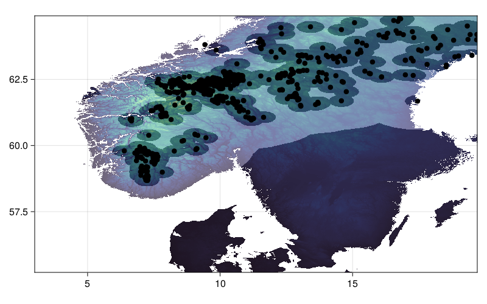

# Deep learning-based Species Distribution Model


This project is actually a nice research project, that may be continued. Persons interested in further developing this approach may contribute to [the `ml-based-SDM` dedicated github repository](https://gitlab.ethz.ch/tsanche/ml-based-sdm).

## Project description and objectives
A **Species Distribution Model (SDM)** is a type of predictive modeling approach used in ecology and conservation biology to understand and predict the distribution of species in a particular geographic area. SDMs use statistical methods to relate the occurrence or abundance of a species to environmental variables, such as temperature, precipitation, elevation, and land use. The model can then be used to predict the distribution of the species across the landscape, even in areas where the species has not been observed. SDMs are useful for understanding the factors that determine the distribution of species and for predicting how changes in the environment may impact the distribution of species in the future. Machine learning algorithms such as neural networks have shown great potential in building accurate SDMs. However, choosing the right hyperparameters for these models is crucial for their performance.


### Project Objective
The objective of this project is to build an advanced deep learning-based SDM that can be trained on GBIF data. The model should be written in pure Julia, and rely on the Flux.jl deep learning library.

You have access to the draft of a script template in `material/Projects/Victor/ml-based-SDM/DL-based-SDM.jl`, where you will find a bunch of functions 
- `download_GBIF_data`
- `generate_presence_data`
- `generate_absence_data`
- `generate_training_data`
- `train`

As well as a very simple DL model

```julia
model = Chain(Dense(size(preds, 1), 64, relu),
                BatchNorm(64),
                Dense(64, 32, relu),
                BatchNorm(32),
                Dense(32, 1, sigmoid),)
```

Additionally, we have generated the raster files with the script `generate_chelsa_data.jl`. You may have a look at it.

Different sub-objectives can be adressed, and may be distributed among different teams. Ideally, the team should collaborate on a public repository, so that the work of each benefits others. It is a good idea to try first running `DL-based-SDM.jl` on your local machine.

#### Enhance the generation of pseudo-absence data
One of the biggest challenges in building accurate SDMs is the generation of pseudo-absence data. Pseudo-absence data refers to the locations where a species is expected to be absent, but where it has not been observed. Generating high-quality pseudo-absence data is crucial for improving the performance of SDMs.

To generate pseudo absence data, the approach used in the template script simply draws at random a coordinate within the spatial extent considered, and assumes that the species is not present there. However, this approach can lead to biased results, as it may include locations where the species is actually present.

A more advanced random sampling technique consists in excluding the area within a certain radius from each of the occurence data points.

||
|-|
|In this plot, occurence data points are plotted as black dots. The area considered for generating the pseudo-absence data is indicated by the light shaded zone, and has been generated by exlcuding areas within 20km of occurence datapoints.|
|Credits to Poisot Lab.|

The objective of this project is to implement such an approach. You may use the package [Distance.jl](https://github.com/JuliaStats/Distances.jl)

#### DL-SDM for community prediction
While the proposed DL-SDM can predict the presence of a single species, predicting the occurence of species community may be beneficial, as ecological interactions may be important in determining a species distribution. This objective aims at developing a deep learning model to map the distribution of communities of species.


You may want to consider communities of trees, which should be investigated within the raster used in the template provided. `GBIF` and its [Julia API](https://github.com/rafaqz/GBIF2.jl) are your friends - make sure to download the appropriate data. You may also get inspiration from a R script written by Théophile Sanchez and Shuo Zong, located in 

```
Projects/Victor/ml-based-SDM/community_DL_SDM
```

#### Convolutional neural network (CNN) SDM
A CNN is a type of deep learning model that is commonly used in image recognition tasks, but can also be applied to other types of data, such as environmental variables. CNN can grasp how local landscape structure affects prediction of species occurrence in SDMs. Studies have demonstrated that CNN-SDM models show a noticeable gain in performance (see, e.g., [Deneu et al. 2021](https://journals.plos.org/ploscompbiol/article?id=10.1371/journal.pcbi.1008856)).


This objective consists in developing a CNN-SDM in Julia. To proceed, you may take inspiration from a `pytorch`-based CNN SDM, accessible [here](https://gitlab.inria.fr/bdeneu/cnn-sdm). 
#### Hyperparameter optimization

Hyperparameters of a neural network model are parameters that are not learned during training but are set by the user before training. The hyperparameters define the structure and behavior of the neural network and influence how the model learns from the input data. Some common hyperparameters of a neural network model include:

- Number of hidden layers: This defines the number of layers between the input and output layers of the neural network.
Number of neurons in each hidden layer: This defines the number of nodes or neurons in each hidden layer of the neural network.

- Activation function: This defines the mathematical function used to transform the output of each neuron in the neural network.

- Learning rate: This defines the step size or the rate at which the model updates the weights during training.

- Dropout rate: This defines the fraction of neurons in the neural network that are randomly dropped out during training to prevent overfitting.

In the template script, the model architecture includes several dense layers with ReLU activation, batch normalization, and a sigmoid output layer.

Optimizing these hyperparameters can significantly improve the performance of the neural network and the accuracy of the model predictions. 

The participants can follow two approaches to optimize the hyperparameters of the neural network:

  - **a. Grid search** Grid search involves defining a grid of hyperparameters and evaluating the performance of the model for each combination of hyperparameters. The best combination of hyperparameters is selected based on the performance on the validation set. Participants should define a range of values for each hyperparameter and generate a grid of all possible combinations. The performance of the model should then be evaluated for each combination of hyperparameters. Participants should choose the combination of hyperparameters that gives the best performance on the validation set.

  - **b. Bayesian hyperparameter optimization** Bayesian optimization is a more sophisticated method that uses probabilistic models to explore the hyperparameter space efficiently. Bayesian optimization builds a probabilistic model of the objective function (in this case, the performance of the SDM on the validation set) and uses it to select the next set of hyperparameters to evaluate. Participants should define a prior distribution for each hyperparameter and use it to initialize a probabilistic model. The model should be updated iteratively by evaluating the performance of the model for different hyperparameter combinations. The next set of hyperparameters to evaluate should be selected based on the model's prediction of the best combination of hyperparameters. The optimization process should continue until a satisfactory performance is achieved. Participants are invited to use [Hyperopt.jl](https://github.com/baggepinnen/Hyperopt.jl).
#### Useful resources

- [A Conceptual Explanation of Bayesian Hyperparameter Optimization for Machine Learning](https://towardsdatascience.com/a-conceptual-explanation-of-bayesian-model-based-hyperparameter-optimization-for-machine-learning-b8172278050f)

## Acknowledgement
This project has been partly inspired by work from Theopile Sanchez and Shuo Zong, and from the documentation of [SpeciesDistributionToolkit.jl](https://github.com/PoisotLab/SpeciesDistributionToolkit.jl).