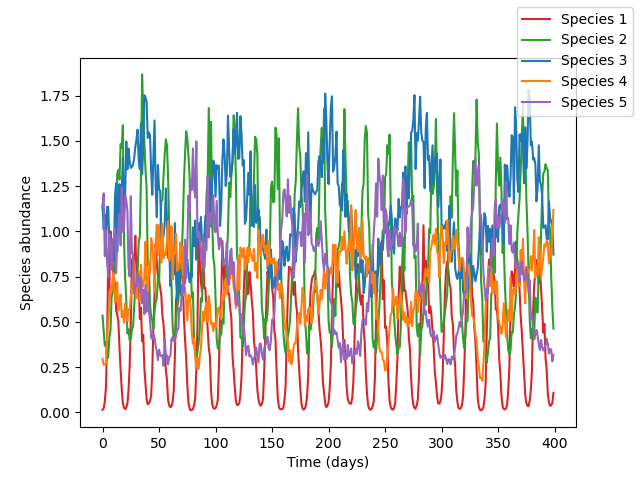
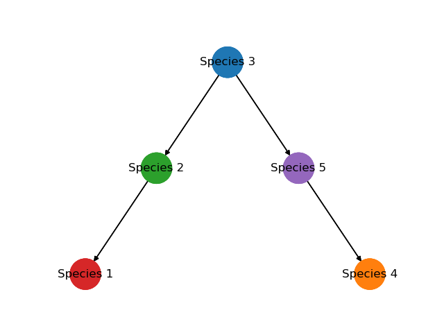

# Ecosystem time series modelling

## Project description
This project focuses on exploring various modelling techniques to analyze an ecological time series and derive predictive insights. The project may cover several techniques, including a**utoregressive models**, **recurrent neural networks**, and **ordinary differential equation models**. 

#### Project Objectives
You are given a `time_series.csv` file, containing ecological time series of a 5-compartment ecosystem (see above). You are also given the foodweb structure of this ecosystem:

Your goal: **build a predictive model**! Here is a list of approaches that you may use

- **Autoregressive models**: Implement and fit different autoregressive (AR) models to the time series data using the ARMA.jl package. Compare and contrast the performance of different AR models, such as AR(1), AR(2), and AR(p), using metrics like Akaike Information Criterion (AIC) and Bayesian Information Criterion (BIC).

- **Recurrent neural networks (RNNs)**: Build and train an RNN using the Flux.jl.

- **ODE models**: Develop an ODE model of the ecosystem. Use the `SimpleEcosystemModel` from `EcoEvoModelZoo.jl`, and get inspiration from this cool [tutorial that explains how to fit a 3 compartment ecosystem model with PiecewiseInference.jl](https://vboussange.github.io/post/piecewiseinference/) 

- **Ensemble modelling**: Combine the different models developed in steps 2-4 using an ensemble approach, such as stacking or bagging, to improve the overall forecasting accuracy. Evaluate the performance of the ensemble model using metrics like MSE, RMSE, and Mean Absolute Percentage Error (MAPE).

- **Visualization and interpretation**: Use visualization tools to plot the results of the different modelling techniques and interpret the findings. Discuss the strengths and limitations of each method and suggest possible future research directions.

